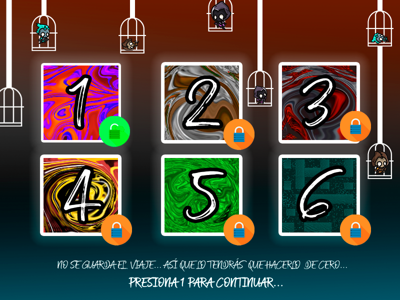

# El Escape de los Nueve Círculos

**"El Escape de los Nueve Círculos"** is a simple yet captivating **video game** inspired by the great literary work **"The Divine Comedy"** by Dante Alighieri. 
The game follows the journey of a character trapped in Hell, as they navigate through various mazes representing the nine circles of Hell. 
With each level, the character must escape the labyrinths of each circle to finally achieve freedom.

The game is developed in `C` and uses the **Allegro** library, a cross-platform library primarily used for game development. 

